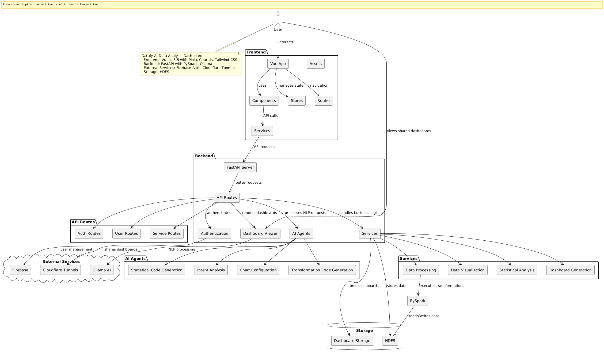

# 📊 Zenith Powerful Data Analytics and Dashboard builder.

A sophisticated web application that combines data processing, analysis, and visualization capabilities with an intuitive dashboard builder interface. Built with Vue.js and FastAPI, this platform enables users to create custom visualizations and perform complex analyses through a user-friendly interface.

[](https://www.youtube.com/watch?v=nEpevi5AF5w)

## 📑 Table of Contents
- [✨ Features](#-features)
- [🔄 System Architecture](#-system-architecture)
- [🛠️ Technologies Used](#-technologies-used)
- [📋 Prerequisites](#-prerequisites)
- [⚙️ Installation](#-installation)
- [📝 Usage](#-usage)
- [🔌 API Structure](#-api-structure)
- [💻 Development](#-development)
- [🤝 Contributing](#-contributing)
- [📜 License](#-license)
- [🆘 Support](#-support)

## ✨ Features

- 🎨 Create custom data visualizations through a drag-and-drop interface
- 🔍 Process and analyze data through natural language queries
- 🏗️ Build sophisticated dashboards without writing code
- ⚡ Perform complex analyses through PySpark integration
- 🧠 Access AI-powered insights through Ollama integration
- 🌐 Share dashboards publicly using Cloudflare Tunnels

## 🔄 System Architecture



## Workflow


## 🛠️ Technologies Used

### 🖥️ Frontend
- ⚡ Vue.js 3.5 for the user interface
- 📦 Pinia for state management
- 🧭 Vue Router for navigation
- 📈 Chart.js for interactive data visualization
- 🎨 Tailwind CSS with DaisyUI for styling

### ⚙️ Backend
- 🚀 FastAPI for the REST API implementation
- 🔥 PySpark for distributed data processing
- 🤖 Ollama for local AI model integration
- 🐍 Python 3.8+ for backend services

## 📋 Prerequisites

- 📦 Node.js (version 18.0.0 or higher)
- 🐍 Python (version 3.8 or higher)
- ☕ Java Runtime Environment (JRE) for PySpark
- 🤖 Ollama installation
- 🐘 Apache Hadoop (version 3.2 or higher)

## ⚙️ Installation

### 📥 Clone Repository
```bash
git clone https://github.com/Janarthanan-Gnanamurthy/LatticePoint.git
cd LatticePoint
```

### 🖥️ Frontend Setup
```bash
npm install
npm run dev
```

### ⚙️ Backend Setup
```bash
python -m venv venv
source venv/bin/activate  # On Windows, use: venv\Scripts\activate
pip install -r requirements.txt
uvicorn main:app --reload
```

### 🐘 Hadoop Setup

1. Download Hadoop from the [official website](https://hadoop.apache.org/releases.html)
2. Extract the archive to a suitable location
3. Configure Hadoop according to your environment (standalone or cluster mode)
4. Start Hadoop services:
```bash
# Navigate to Hadoop directory
cd [hadoop-directory]

# Start Hadoop
./sbin/start-all.sh  # On Windows, use: sbin\start-all.cmd
```
5. Verify the services are running:
```bash
jps
```

### 🤖 Ollama Setup

For Unix-based systems:
```bash
curl https://ollama.ai/install.sh | sh
```

For Windows:
- Download and install from https://ollama.ai/download

Pull required model:
```bash
ollama pull deepseek-r1:8b
```

## 📝 Usage

### 🎨 Dashboard Builder

The Dashboard Builder provides:
- 🧩 Widget type interface for creating custom dashboards
- 📊 Multiple chart types and visualization options
- ⏱️ Real-time data updates and previews
- 🎛️ Customizable layouts and settings
- 🔍 Interactive data filtering
- 💾 Save and share functionality
- 📜 Version history management

#### 🚀 Using the Dashboard Builder

1. 🔓 Access the dashboard builder interface
2. 🏞️ Start with a blank canvas
3. 🧩 Add visualization components through drag-and-drop
4. ⚙️ Configure data sources and chart settings
5. 💬 Use natural language queries for data processing
6. 💾 Save and share your dashboard configurations
7. 🔗 Click the "Share Dashboard" button to create a public URL for your dashboard

### 🔗 Sharing Dashboards

The application includes a dashboard sharing feature using Cloudflare Tunnels:

1. 🖱️ After building your dashboard, click the "Share Dashboard" button
2. ✏️ Enter a name for your dashboard
3. 🔗 The system will create a public URL that you can share with anyone
4. 👀 Recipients can view your dashboard through their web browser without needing to install anything

### 👁️ Dashboard Viewer

A standalone dashboard viewer application is included for viewing shared dashboards:

1. 🚀 Run the dashboard viewer: 
   ```bash
   # On Unix/Linux/Mac:
   ./Backend/start_dashboard_viewer.sh
   
   # On Windows:
   Backend\start_dashboard_viewer.bat
   ```
2. 🌐 The viewer will start at http://localhost:8050
3. 🔧 Follow the instructions to set up Cloudflare Tunnels for public access
4. 📱 Recipients can access dashboards using the public URL created by Cloudflare Tunnels

## 🔌 API Structure

The backend API provides these key endpoints:
- `📊 /process` - Handles data processing requests
- `🔍 /analyze` - Manages analysis operations
- `📋 /dashboard` - Controls dashboard configurations

## 💻 Development

For building production assets:
```bash
npm run build
```

For running tests:
```bash
npm run test
```

## 🤝 Contributing

We welcome contributions to improve the platform. Please review our contributing guidelines before submitting pull requests.

## 📜 License

This project is licensed under the MIT License.

## 🆘 Support

For technical support or questions, please create an issue in the GitHub repository. Our team actively monitors and responds to reported issues.
